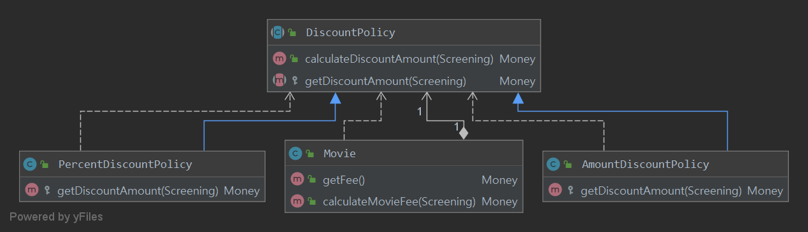
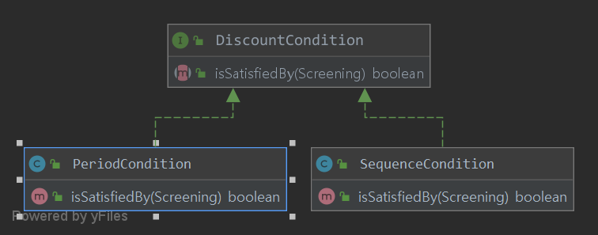
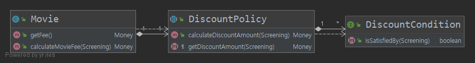
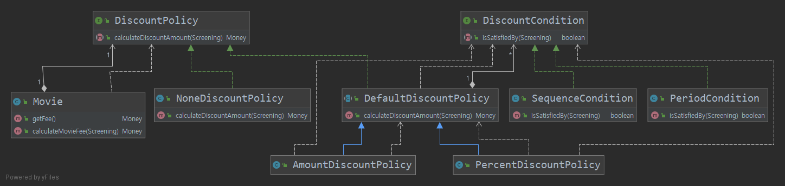

# CHAPTER02 객체지향 프로그래밍

## 01. 영화 예매 시스템

### 영화 예매 시스템 목적과 개념 및 할인 규칙

- 사용자는 영화 예매 시스템을 이용해 빠르게 보고 싶은 영화를 예매 할 수 있다.

- 영화 : 영화에 대한 기본정보 (제목,상영시간,가격정보)

- 상영 : 실제로 관객들이 영화를 관람하는 사건

- 사용자가 예매하는 대상은 영화가 아니라 상영이다.

- 할인액을 결정하는 두 가지 규칙 : 할인 조건(dicsount condition), 할인 정책(discount policy)

  - 할인조건 : 가격의 하인 여부를 결정
    - 순서 조건 :상영 순번을 이용해 할인 여부 결정
    - 기간 조건 : 요일,시작시간,종료시간 세부분으로 구성되며 영화시작시간이 해당 기간안에 포함될 경우 요금을 할인
  - 할인 정책 : 할인 요금을 결정
    - 금액 할인 정책 : 일정 금액을 할인
    - 비율 할인 정책 : 정가에서 일정 비율의 요금을 할인

- 영화별로 최대로 하나의 할인 정책만 할당할 수 있다.

  할인 조건은 여러개 지정가능하다.


## 02. 객체지향 프로그래밍을 향해

### 협력, 객체, 클래스

객체지향 프로그램을 작성할 때 가장 먼저 고려하는 것은 무엇인가?

- 대부분 가장 먼저 어떤 클래스가 필요한지 고민한다. 클래스를 결정한 후에 클래스에 어떤 속성과 메서드가 필요한지 고민한다.
- 그러나 이것은 객체지향의 본질과는 거리가 멀다.

**객체지향 패러다임으로의 전환은 클래스가 아닌 객체에 초점을 맞출때에만 얻을 수 있다.**

1. 어떤 클래스가 필요한지를 고민하기 전에 어떤 객체들이 필요한지 고민하라
   - 클래스는 공통적인 상태와 행동을 공유하는 객체들을 추상화한 것
   - 클래스의 윤곽을 잡기 위해서는 어떤 객체들이 어떤 상태와 행동을 가지는지를 먼저 결정해야한다.
   - 객체를 중심에 두는 접근 방법은 설계를 단순하고 깔끔하게 만든다.
2. 객체를 독립적인 존재가 아니라 기능을 구현하기 위해 협력하는 공동체의 일원으로  봐야 한다.
   - 객체를 협력하는 공동체의 일원으로 바라보는 것은 설계를 유연하고 확장 가능하게 만든다.
   - 객체들의 모양과 윤곽이 잡히면 공통된 특성과 상태를 가진 객체들을 타입으로 분류하고 이 타입을 기반으로 클래스를 구현하라.


### 도메인 구조를 따르는 프로그램 구조

* **도메인** : 문제를 해결하기 위해 사용자가 프로그램을 사용하는 분야

객체지향 패러다임이 강력한 이유는 요구사항을 분석하는 초기단계부터 프로그램을 구현하는 마지막 단계까지 객체라는 동일한 추상화 기번을 사용할 수 있기 때문이다.

###### [영화 예매 도엔을 구성하는 개념과 관계를 표현한 그림]


- 일반적으로 클래스의 이름은 대응되는 도메인 개념의 이름과 동일하거나 유사하게 지어야 한다.


### 클래스 구현하기

도메인 개념들의 구조를 반영하는 적절한 클래스 구조를 만들었으니 남은 일은 적절한 프로그래밍 언어를 이용해 이 구조를 구현하는 것이다.

- 클래스를 구현하거나 다른 개발자에 의해 개발된 클래스를 사용할 때 가장 중요한 것은 클래스의 경계를 구분 짓는 것이다.
  - 구현한 클래스를 보면 인스턴스 변수의 가시성은 private이고 메서드의 가시성은 public이다.
  - 경계의 명확성이 객체의 자율성을 보장한다.
  - 또한 프로그래머에게 구현의 자유를 제공한다.

#### 자율적인 객체

1. 객체 = 상태 + 행동
2. 객체는 자율적인 존재다.

객체지향 이전의 패러다임(예를 들면 절자지향)에서는 데이터와 기능이라는 독립적인 존재를 서로 엮어 프로그램을 구성했다.

객체지향은 객체 단위 안에서 데이터와 기능을 한 덩어리로 묶음으로써 문제 영역의 아이디어를  적절하게 표현할 수 있게 했다.

- **캡슐화** : 데이터와 기능을 객체 내부로 함께 묶는 것
  - 캡슐화를 통해 객체를 자율적인 존재로 만든다.
  - 자율적인 존재로 만들기 위해서는 외부의 간섭을 최소화해야 하니까

대부분의 객체지향 프로그래밍 언어들은 캡슐화에서 더나아가 **접근제어**와 **접근 수정자**를 제공한다.

캡슐화와 접근제어는 객체를 두 부분으로 나눈다.

- 퍼블릭 인터페이스 : 외부에서 접근 가능한 부분
- 구현 : 외부에서 접근불가능하고 오직 내부에서만 접근가능한 부분

- 인터페이스와 구현의 분리 원칙은 훌륭한 객체지향 프로그래밍의 핵심 원칙

#### 프로그래머의 자유

프로그래머의 역할은 클래스 작성자와 클라이언트 프로그래머로 구분하는 것이 용이하다.

클래스 작성자는 클라이언트 프로그래머 숨겨 놓은 부분에 마음대로 접근할 수 없도록 방지함으로써 클라이언트 프로그래머에 대한 영향을 걱정하지 않고도 내부 구현을 마음대로 변경할 수 있다.

이를 **구현 은닉(implementation hiding)**이라 한다.

접근제어는 

- 클래스 내부외부를 명확하게 경계를 지을수 있다.
- 클래스 작성자가 내부 구현을 은닉할 수 있게  해준다.
- 클라이언트 프로그래머가 외부에서 숨겨진 부분에 접근하는 것을 막아준다.

설계가 필요한 이유 = 변경을 관리하기 위해

객체지향 언어는 객체 사이의 의존성을 적절히 관리함으로써 변경에 대한 파급효과를 제어하는 다양한 방법을 제공한다.

객체 변경을 관리하는 방법 중에 가장 대표적인 것이 접근 제어다.

-> 변경 가능성이 있는 세부적인 구현 내용은 private 영역안에 감추으로써 변경으로 인한 혼란을 최소화하자


### 협력하는 객체들의 공동체

- Money 클래스
  - 1장에서는 금액을 구현하기위해 Long 타입을 사용했었다.
  - Long 타입은 변수 크기나 연산자 종류와 관련된 구현관점의 제약은 표현 가능하지만 Money타입처럼 저장하는 값이 금액과 관련돼 있다는 의미는 전달할 수 없다.
  - 또한 금액과 관련된 로직이 서로 다른 곳에 중복되어 구현되는 것을 막을 수 없다.
  - 객체지향 장점이 객체를 이용해 도메인의 의미를 풍부하게 표현할수 있다는 것이다.
  - 따라서 명시적이고 분현하게 표현할 수 있다면 객체를 사용해서 해당 개념을 구현하라
  - 개념을 명시적으로 표현하는 것은 전체적인 설계의 명확성과 유연성을 높여준다.

- Screening,Movie,Reservation 클래스
  - 영화를 예매하기 위해 서로의 메서드를 호출하며 상호작용한다.

**객체지향 프로그램을 작성 할때는 먼저 협력의 관점에서 어떤 객체가 필요한지를 결졍하라**

**그리고 객체들의 공통상태와 행위를 구현하기 위해 클래스를 작성하라**


#### 협력에 관한 짧은 이야기

메세지와 메서드를 구분해라 -> 다형성의 개념의 출발

메세지 : 객체가 다른객체와 상호작용하는 유일한 방법

메서드 : 수신된 메세지를 처리하기 위한 자신만의 방법


## 03. 할인 요금 구하기

### 할인 요금 계산을 위한 협력 시작


#### 템플릿 메서드 패턴

- 어떤 작업을 처리하는 일부분을 서브 클래스로 캡슐화해 전체 일을 수행하는 구조는 바꾸지 않으면서 특정 단계에서 수행하는 내역을 바꾸는 패턴

  - 즉, 전체적으로는 동일하면서 부분적으로는 다른 구문으로 구성된 메서드의 코드 중복을 최소화 할 때 유용하다.

  - 다른 관점에서 보면 동일한 기능을 상위 클래스에서 정의하면서 확장/변화가 필요한 부분만 서브 클래스에서 구현할 수 있도록 한다.

  - 예를 들어, 전체적인 알고리즘은 상위 클래스에서 구현하면서 다른 부분은 하위 클래스에서 구현할 수 있도록 함으로써 전체적인 알고리즘 코드를 재사용하는 데 유용하도록 한다.

    

  - 역할이 수행하는 작업

    - AbstractClass
      - 템플릿 메서드를 정의하는 클래스
      - 하위 클래스에 공통 알고리즘을 정의하고 하위 클래스에서 구현될 기능을 primitive 메서드 또는 hook 메서드로 정의하는 클래스
    - ConcreteClass
    - 물려받은 primitive 메서드 또는 hook 메서드를 구현하는 클래스
    - 상위 클래스에 구현된 템플릿 메서드의 일반적인 알고리즘에서 하위 클래스에 적합하게primitive 메서드나 hook 메서드를 오버라이드하는 클래스
      참고

- https://gmlwjd9405.github.io/2018/07/13/template-method-pattern.html

## 04. 상속성과 다형성

Movie 내부에 할인 정책을 결정하는 조건문이 없는데도 불구하고 어떻게 영화 요금을 계산할 때 할인 정책과 비율 할인 정책을 선택할 수 있을까?

### 컴파일 시간 의존성과 실행 시간 의존성

어떤 클래스가 다른 클래스에 접근 할 수 있는 경로를 가지거나 해당 클래스의 객체의 메서드를 호출하는 경우 두 클래스 사이에 의존성이 존재한다고 말한다.



- Movie 클래스는 DiscountPolicy와 연결돼 있다.
- Movie는 영화 요금 계산하기 위해 DiscountPolicy가 아닌 AmountDiscountPolicy와 PercentDiscountPolicy 인스턴스가 필요하다
- 실행시에 AmountDiscountPolicy와 PercentDiscountPolicy 의존해야한다.
- 코드상에서는 두 인스턴스 의존 X. 오직 DiscountPolicy에만 의존
- 그렇다면 Movie의 인스턴스가 실행시에 AmountDiscountPolicy와 PercentDiscountPolicy인스턴스와 협력 가능한 이유는?
  - Movie 생성자에서 DiscountPolicy 타입의 객체를 인자로 받음
  - 따라서 코드상에서는 DiscountPolicy에 의존하지만 실행 시점에는 AmountDiscountPolicy와 PercentDiscountPolicy인스턴스에 의존한다.

#### 정리

- 코드의 의존성과 실행 시점의 의존성은 서로 다를 수 있다.
  - 유연하고 쉽게 재사용할 수 있으며 확장 가능한 객체지향 설계가 가지는 특징임
- 다시 말해, 클래스 사이의 의존성과 객체 사이의 의존성은 동일하지 않을 수 있다.

- 코드의 의존성과 실행시점의 의존성이 다르면 다를수록 
  - 코드를 이해하기 어려워진다. 
  - 유연해지고 확장 가능해진다.
- 의존성의 양면성은 설계가 트레이드오프의 산물이라는 사실을 잘 보여준다.


- 설계가 유연해질 수록
  - 코드 이해가 어려워진다
  - 디버깅하기 어려워진다
- 설계 유연성 억제하면
  - 코드 이해 쉬워진다
  - 디버깅하기 쉬워진다
  - 재사용성과 확장 가능성이 낮아진다

-> 따라서 유연성과 가독성에 고민을 해야한다.


코드 상에 존재하는 Movie클래스에서 DiscountPolicy 클래스로의 의존성이 어떻게 실행 시점에는 AmountDiscountPolicy와 PercentDiscountPolicy 인스턴스에 대한 의존성으로 바뀔수 있을까?

### 차이에 의한 프로그래밍

추가하려는 클래스가 기존의 어떤 클래스와 매우 흡사하다면 그 클래스를 수정하지 않고 재사용하는 것이 가장 좋은 방법일 것이다. 이를 가능하게 하는 것이 `상속`이다.

상속은 객체지향에서 코드를 재사용하기 위해 가장 널리 사용되는 방법이다.

상속을 이용하면 클래스 사이에 관계를 설정하는 것만으로 기존 클래스가 가지고 있는 모든 속성과 행동을 새로운 클래스에 포함시킬 수 있다.

또한 상속을 이용하면 부모 클래스의 구현은 공유하면서도 행동이 다른 지식클래스를 쉽게 추가할 수 있다.

이처럼 부모클래스와 다른 부분만을 추가해서 새로운 클래스를 쉽고 빠르게 만드는 방법을 `차이에 의한 프로그래밍`이라 한다.

### 상속과 인터페이스

상속이 가치있는 이유 : 부모 클래스가 제공하는 모든 인터페이스를 자식 클래스가 물려받기 때문

대부분의 사람들은 상속의 목적이 메서드나 인스턴스 변수를 재사용하는 것이라 생각한다.

인터페이스는 객체가 이해할 수 있는 메시지 목록을 정의한다. 

상속을 통해 자식 클래스는 자신의 인터페이스에 부모 클래스의 인터페이스를 포함한다 -> 부모객체가 이행할수 있는 메세지 목록도 자식객체에 포함된다.

결과적으로 자식 클래스는 부모클래스가 수신할 수 있는 모든 메세지를 수신할 수 있다. -> 외부 객체는 자식 클래스를 부모클래스와 동일한 타입으로 간주 할 수 있다.

- Movie 입장에서는 자신과 협력하는 객체가 어떤 클래스의 인스턴스인지가 중요한게 아니라 `calculateDiscountAmount()`를 수신할 수 있다는 사실이 중요하다.
- Movie는 `calculateDiscountAmount()`메세지를 이해할 수만 있다면 어떤 클래스의 인스턴스인지 상관없다.
- 그래서 AmountDiscountPolicy와 PercentDiscountPolicy 모두 Movie와 협력 할 수 있는 것이다.

#### 정리

- 자식 클래스는 상속을 통해 부모 클래스의 인터페이스를 물려받기 때문에 부모클래스를 대신하여 사용될 수 있다.
- 컴파일러는 코드 상에서 부모클래스가 나오는 모든 장소에서 자식 클래스를 사용하는 것을 허용한다.
- 업캐스팅 : 자식 클래스가 부모클래스를 대신하는 것

### 다형성

다시 한 번더 강조하지만 메세지와 메서드는 다른 개념이다.

- Movie는 DiscountPolicy의 인스턴스에게 `calculateDiscountAmount()`메세지를 전송한다.
- 그렇다면 실행되는 메서드는 무엇인가?
- 연결된 객체의 클래스가 무엇인가에 따라 달라진다.

정리하자면

- 동일한 메세지를 전송하지만 실제로 어떤 메서드가 실행될 것인지는 메세지를 수신하는 객체의 클래스가 무엇이냐에 따라 달라진다. = `다형성`

다형성은 객체지향 프로그램의 컴파일 시간 의존성과 실행 시간 의존성이 다를 수 있다는 사실을 기반으로 한다.

다형성 정의 : 동일한 메세지를 전송하지만 실제로 어떤 메서드가 실행될 것인지는 메세지를 수신하는 객체의 클래스가 무엇이냐에 따라 달라진다.

- 다형적인 협력에 참여하는 객체들은 모두 같은 메세지를 이해할 수 있어야한다.
- 즉, 인터페이스가 동일해야 한다.

다형성을 구현하는 방법은 다양하지만 메세지에 응답하기 위해 실행될 메서드를 컴파일 시점이 아닌 실행시점에 결정한다는 공통점이 있다. -> 메세지와 메서드를 실행시점에 바인딩함 = 지연 바인딩,동적 바인딩 <-> 초기 바인딩,정적 바인딩

상속을 이용하면 동일한 인터페이스를 공유하는 클래스들을 하나의 타입 계층으로 묶을 수 있다. 

-> 그래서 다형성이야기 할때 상속도 같이 언급된다.

-> 하지만 다형성 구현하는 방법이 상속이 유일한 방법은 아니다.


#### 구현상속과 인터페이스 상속

- 구현 상속 : 코드를 재사용하기 위한 목적으로 상속을 사용하는 것
- 인터페이스 상속 : 다형적인 협력을 위해 부모 클래스와 자식 클래스가 인터페이스를 공유할 수 있도록 상속을 사용하는 것
- 구현상속이 아니라 인터페이스 상속을 해야한다.
- 구현을 재사용할 목적으로 상속하면 변경에 취약한 코드를 낳게 될 확률이 높다


### 인터페이스와 다형성

할인 조건을 보면 구현은 공유할 필요가 없기 때문에 인터페이스를 이용해 타입 계층을 구현했다.

DiscountCondition인터페이스를 실체화하고 있는 SequenceCondition과 PeriodCondition은 동일한 인터페이스를 공유하며 다형적인 협력에 참여할 수 있다.



- 이 경우에도 업캐스팅이 적용되며 협력은 다형적이다.


## 05. 추상화와 유연성

### 추상화의 힘

할인 정책은 구체적인 할인 정책과 비율 할인 정책을 포괄하는 추상적인 개념이다

할인 조건 역시 더 구체적인 순번 조건과 기간 조건을 포활하는 추상적인 개념이다

다시 말해 DiscountPolicy는 AmountDiscountPolicy와 PercentDiscountPolicy보다 추상적이다.

DiscountCondition도 마찬가지로 더 추상적이다


프로그래밍 언어 측면에서 DiscountPolicydhk DiscountCondition이 더 추상적인 이유는 인터페이스에 초점을 맞추기 때문이다.

둘 다 같은 계층에 속하는 클래스들이 공통으로 가질수 있는 인터페이스를 정의하며 구현의 일부 또는 전체를 자식 클래스가 결정할 수 있도록 결정권을 위임한다.

[자식 클래스를 생략한 코드 구조 그림]



이 그림은 추상화를 사용할 경우 다음과 같은 장점을 보여준다.

1. 추상화의 계층만 따로 떼어 놓고 보면 요구사항의 정책을 높은 수준에서 서술 할 수 있다.
   - 이그림에 따르면 `영화예매요금은 최대 하나의 할인 정책과 여러 할인 조건을 이용해 계산할 수 있다.`로 표현가능하다.
   - 위 문장은 `영화 예매 요금은 금액할인 정책과 두개의 순서 조건,한개의 기간 조건을 이용해서 계산할 수 있다`라는 문장을 포괄할 수 있다는 사실이 중요하다. -> 할인 정책과 할인 조건이라는 좀 더 추상적인 개념들을 사용했기 때문이다.
   - 상위 개념만으로도 도메인의 중요한 개념을 설명할 수 있게 한다.
   - 추상화를 이용한 설계는 필요에 따라 표현의 수준을 조정하는 것을 가능하게 해준다.
   - 추상화를 이용해 상위 정책을 기술한다 = 기본적인 애플리케이션의 협력 흐름을 기술한다.
     - 이 개념이 매우 중요한데, 재사용 가능한 설계의 기본을 이루는 디자인 패턴이나 프레임워크 모두 추상화를 이용해 상위 정책을 정의하는 객체지향의 메커니즘을 활용하고 있기 때문이다.
2. 설계가 좀더 유연해진다.
   - 추상화를 이용해 상위 정책을 표현하면 기존 구조를 수정하지 않고도 새로운 기능을 쉽게 추가하고 확장 할 수 있다.
   - 즉, 설계를 유연하게 만들 수 있다.

### 유연한 설계

- 현재 소스코드는 39페이지에 따르면 영화 스타워즈에 대한 할인 정책이 해결되지 않은 상태다.

- 할인 정책이 적용되어 있지 않기 때문에 할인 요금 계산없이 기본 금액 그대로 사용하면 된다.

  ```java
  public Money calculateMovieFee(Screening screening) {
      if(discountPolicy==null){
          return fee;
      }
      return fee.minus(discountPolicy.calculateDiscountAmount(screening));
  }
  ```

  - 문제점은 할인 정책이 없는 경우를 예외 케이스로 취급하기 때문에 지금까지 일관성있던 협력방식이 무너지게 된다.

  - 기존 할인 정책의 경우 할인할 금액을 계산하는 책임이 DiscountPolicy의 자식 클래스에 있었지만 할인정책이 없는 경우에는 할인 금액이 0원이라는 사실을 결정하는 책임이 DiscountPolicy가 아닌 Movie쪽에 있기 때문이다.

  - 따라서, 책임의 위치를 결정하기 위해 조건문을 사용하는 것은 협력의 설계 측면에서 대부분 좋인 않은 선택이다.

  - `항상 예외 케이스를 최소화하고 일관성을 유지할 수 있는 방법을 선택해라.`

  - 해당 서비스의 경우는 0원 할인 요금을 계산할 책임을 그대로 DiscountPolicy 계층에 유지시켜야한다. 

    - [NoneDiscountPolicy](./pricing/NoneDiscountPolicy.java) 클래스 추가를 한다.

    - 중요한 것은 기존의 Movie와 DiscountPolicy는 수정하지 않고, NoneDiscountPolicy 클래스 추가만으로 애플리케이션 기능을 확장했다는 것이다.
    - 추상화 중심으로 코드의 구조를 설계하면 유연하고 확장 가능한 설계를 만들 수 있다.

    

  추상화가 유연한 설계를 가능하게 하는 이유는 설계가 구체적인 상황에 결합되는 것을 방지하기 때문이다.

  - Movie는 특정 할인 정택에 묶이지 않는다.
  - DiscountPolicy  역시 특정 할인 조건에 묶이지 않는다.

  

  컨텍스트 독립성이라 불리는 이 개념은 프레임워크와 같은 유연한 설계가 필수적인 분야에서 그 진가를 발휘한다.

  결론 : `유연성이 필요한 곳에 추상화를 사용하라`

  

### 추상클래스와 인터페이스의 트레이드오프

현재 DiscountPolicy에서 할인 조건이 없을 경우에는 getDiscountAmount() 메서드를 호출하지 않기 때문에NoneDiscountPolicy의 getDiscountAmount() 메서드가 어떤 값을 반환하더라도 상관이 없다.

- 이것은 부모클래스인 DiscountPolicy와 NoneDiscountPolicy를 개념적으로 결합시킨다
- NoneDiscountPolicy의 개발자는 getDiscountAmount()가 호출 되지 않을 경우 DiscountPolicy가 0원을 반환할 것이라는 사실을 가정하고 있기 때문이다.

이 문제를 해결하는 방법은 

1. DiscountPolicy를 인터페이스로 바꾸고 
2. NoneDiscountPolicy가 DiscountPolicy의 getDiscountAmount() 메서드가 아닌 calculateDiscountAmount() 오퍼레이션을 오버라이딩하도록 변경하는 것이다.


[인터페이스를 이용하여 구현한 DiscountPolicy]



- 이상적으로는 인터페이스를 사용하도록 변경한 설계가 더 좋을 것이다.
- 현식적으로는 NoneDiscountPolicy만을 위해 인터페이스 추가하는 것이 과하다는 생각이 들 수 있다.
- 변경 전의 NoneDiscountPolicy의 할인 금액이 0원이라는 사실을 효과적으로 전달하기 때문이다.
- 여기서 말하고자하는 것은 구현과 관련된 모든 것들이 트레이드오프의 대상이 될 수 있다는 사실이다.
  - 모든 코드에는 합당한 이유가 있어야 한다.
  - 사소한 결정이더라도 트레이드오프를 통해 얻어진 결론과 그렇지 않은 결론 사이의 차이는 크다
  - 고민하고 트레이드오프해라.

### 코드 재사용

상속은 코드 재사용하기 위해 널리 사용되는 방법이다.

그러나 가장 좋은 방법은 아니다.

코드 재사용을 위해서는 상속보다 합성이 더 좋은 방법이다.

- 합성 : 다른 객체의 인스턴스를 자신의 인스턴스 변수로 포함해서 재사용하는 방법
- Movie가 DiscountPolicy의 코드를 재사용하는 방법이 합성이다.

상속대신 합성을 더 선호하는 이유는 무엇일까?

### 상속

코드 재사용하기 위한 상속은 다음과 같은 관점에서 설계에 안 좋은 영향을 미친다.

- 캡슐화를 위반
  - 상속으로 AmountDiscountMovie와 PercentDiscountMovie를 구현하면 부모 클래스의 내부를 잘 알고 있어야한다.
  - Movie의 calculateMovieFee메서드 안에서 추상 메서드인 getDiscountAmount메서드를 호출한다는 사실을 알고 있어야한다. -> 결과적으로 부모클래스의 구현이 자식클래스에게 노출되기 때문에 캡슐화가 약화된다.
  - 캡슐화 약화 -> 자식클래스가 부모클래스에 강하게 결합되게 만들어  부모클래스 변경할때 자식 클래스도 같이 변경될 확률을 놓인다.
  - 결과적으로 상속을 과도하게 사용한 코드는 변경하기도 어려워진다.

- 설계를 유연하지 못하게 만든다
  - 상속은 부모클래스와 자식 클래스 사이의 관계를 컴파일 시점에 결정한다.
  - 따라서 실행 시점에 객체의 종류를 변경하는 것이 불가능하다.
  - 예를 들어 실행시점에서 정액 할인 정책을 비율 할인 정책으로 바꾸자 한다면 상속으로 구현한 AmountDiscountMovie에서 PercentDiscountMovie의 인스턴스로 변경해야한다.
    - 최선의 방법은 PercentDiscountMovie 인스턴스 생성후 AmountDiscountMovie의 상태를 복사하는 것뿐
    - 반면, 인스턴스 변수로 연결한 기존 방법은 실행 시점에 할인 정책을 간단하게 변경할 수 있다.
  - 따라서, 상속보다 합성을 이용한 설계가 더 유연하다

### 합성

Movie는 요금을 계산하기 위해 DiscountPolicy의 코드를 재사용한다.

상속과 다른 점은 Movie가 DiscountPolicy인터페이스를 통해 약하게 결합된다는 것이다.

합성 : 인터페이스에 정의된 메세지를 통해서만 코드를 재사용하는 방법

합성은 상속이 가지는 두가지 문제를 모두 해결한다.

- 인터페이스에 정의된 메세지를 통해서만 재사용이 가능하기 때문에 구현을 효과적으로 캡슐화 할 수 있다.
- 의존하는 인스턴스 교체하는 것이 비교적 쉽기 때문에 설계를 유연하게 만든다.

따라서, 코드 재사용을 위해서는 상속보다는 합성을 선호하는 것이 더 좋은 방법이다.


## 정리

- 객체지향에서 가장 중요한 것은 애플리케이션의 기능을 구현하기 위해 협력에 참여하는 객체들 사이의 상호작용이다
- 객체들은 협력에 참여하기 위해 역할을 부여받고 역할에 적합한 책임을 수행한다.
- 객체지향 설계의 핵심은 적절한 협력을 식별하고 협력에 필요한 역할을 정의한 후에 역할을 수행할 수 있는 적절한 객체에게 적절한 책임을 할당하는 것이다.

