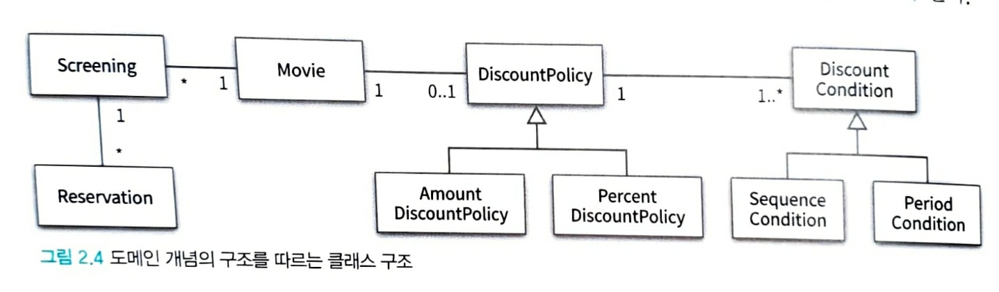
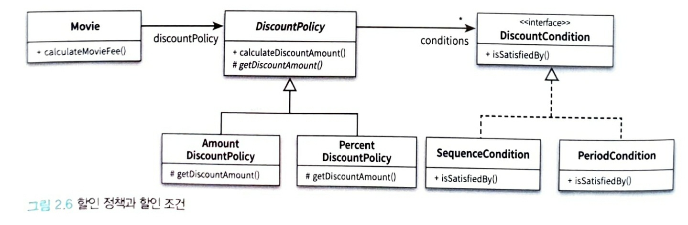

# CHAPTER02 객체지향 프로그래밍

## 영화 예매 시스템

### 영화 예매 시스템 목적과 개념 및 할인 규칙

- 사용자는 영화 예매 시스템을 이용해 빠르게 보고 싶은 영화를 예매 할 수 있다.

- 영화 : 영화에 대한 기본정보 (제목,상영시간,가격정보)

- 상영 : 실제로 관객들이 영화를 관람하는 사건

- 사용자가 예매하는 대상은 영화가 아니라 상영이다.

- 할인액을 결정하는 두 가지 규칙 : 할인 조건(dicsount condition), 할인 정책(discount policy)

  - 할인조건 : 가격의 하인 여부를 결정
    - 순서 조건 :상영 순번을 이용해 할인 여부 결정
    - 기간 조건 : 요일,시작시간,종료시간 세부분으로 구성되며 영화시작시간이 해당 기간안에 포함될 경우 요금을 할인
  - 할인 정책 : 할인 요금을 결정
    - 금액 할인 정책 : 일정 금액을 할인
    - 비율 할인 정책 : 정가에서 일정 비율의 요금을 할인

- 영화별로 최대로 하나의 할인 정책만 할당할 수 있다.

  할인 조건은 여러개 지정가능하다.

## 객체지향 프로그래밍을 향해

### 협력, 객체, 클래스

객체지향 프로그램을 작성할 때 가장 먼저 고려하는 것은 무엇인가?

- 대부분 가장 먼저 어떤 클래스가 필요한지 고민한다. 클래스를 결정한 후에 클래스에 어떤 속성과 메서드가 필요한지 고민한다.
- 그러나 이것은 객체지향의 본질과는 거리가 멀다.

**객체지향 패러다임으로의 전환은 클래스가 아닌 객체에 초점을 맞출때에만 얻을 수 있다.**

1. 어떤 클래스가 필요한지를 고민하기 전에 어떤 객체들이 필요한지 고민하라
   - 클래스는 공통적인 상태와 행동을 공유하는 객체들을 추상화한 것
   - 클래스의 윤곽을 잡기 위해서는 어떤 객체들이 어떤 상태와 행동을 가지는지를 먼저 결정해야한다.
   - 객체를 중심에 두는 접근 방법은 설계를 단순하고 깔끔하게 만든다.
2. 객체를 독립적인 존재가 아니라 기능을 구현하기 위해 협력하는 공동체의 일원으로  봐야 한다.
   - 객체를 협력하는 공동체의 일원으로 바라보는 것은 설계를 유연하고 확장 가능하게 만든다.
   - 객체들의 모양과 윤곽이 잡히면 공통된 특성과 상태를 가진 객체들을 타입으로 분류하고 이 타입을 기반으로 클래스를 구현하라.

### 도메인 구조를 따르는 프로그램 구조

* **도메인** : 문제를 해결하기 위해 사용자가 프로그램을 사용하는 분야

객체지향 패러다임이 강력한 이유는 요구사항을 분석하는 초기단계부터 프로그램을 구현하는 마지막 단계까지 객체라는 동일한 추상화 기번을 사용할 수 있기 때문이다.

###### [영화 예매 도엔을 구성하는 개념과 관계를 표현한 그림]

- 일반적으로 클래스의 이름은 대응되는 도메인 개념의 이름과 동일하거나 유사하게 지어야 한다.

### 클래스 구현하기

도메인 개념들의 구조를 반영하는 적절한 클래스 구조를 만들었으니 남은 일은 적절한 프로그래밍 언어를 이용해 이 구조를 구현하는 것이다.

- 클래스를 구현하거나 다른 개발자에 의해 개발된 클래스를 사용할 때 가장 중요한 것은 클래스의 경계를 구분 짓는 것이다.
  - 구현한 클래스를 보면 인스턴스 변수의 가시성은 private이고 메서드의 가시성은 public이다.
  - 경계의 명확성이 객체의 자율성을 보장한다.
  - 또한 프로그래머에게 구현의 자유를 제공한다.

#### 자율적인 객체

1. 객체 = 상태 + 행동
2. 객체는 자율적인 존재다.

객체지향 이전의 패러다임(예를 들면 절자지향)에서는 데이터와 기능이라는 독립적인 존재를 서로 엮어 프로그램을 구성했다.

객체지향은 객체 단위 안에서 데이터와 기능을 한 덩어리로 묶음으로써 문제 영역의 아이디어를  적절하게 표현할 수 있게 했다.

- **캡슐화** : 데이터와 기능을 객체 내부로 함께 묶는 것
  - 캡슐화를 통해 객체를 자율적인 존재로 만든다.
  - 자율적인 존재로 만들기 위해서는 외부의 간섭을 최소화해야 하니까

대부분의 객체지향 프로그래밍 언어들은 캡슐화에서 더나아가 **접근제어**와 **접근 수정자**를 제공한다.

캡슐화와 접근제어는 객체를 두 부분으로 나눈다.

- 퍼블릭 인터페이스 : 외부에서 접근 가능한 부분
- 구현 : 외부에서 접근불가능하고 오직 내부에서만 접근가능한 부분

- 인터페이스와 구현의 분리 원칙은 훌륭한 객체지향 프로그래밍의 핵심 원칙

#### 프로그래머의 자유

프로그래머의 역할은 클래스 작성자와 클라이언트 프로그래머로 구분하는 것이 용이하다.

클래스 작성자는 클라이언트 프로그래머 숨겨 놓은 부분에 마음대로 접근할 수 없도록 방지함으로써 클라이언트 프로그래머에 대한 영향을 걱정하지 않고도 내부 구현을 마음대로 변경할 수 있다.

이를 **구현 은닉(implementation hiding)**이라 한다.

접근제어는 

- 클래스 내부외부를 명확하게 경계를 지을수 있다.
- 클래스 작성자가 내부 구현을 은닉할 수 있게  해준다.
- 클라이언트 프로그래머가 외부에서 숨겨진 부분에 접근하는 것을 막아준다.

설계가 필요한 이유 = 변경을 관리하기 위해

객체지향 언어는 객체 사이의 의존성을 적절히 관리함으로써 변경에 대한 파급효과를 제어하는 다양한 방법을 제공한다.

객체 변경을 관리하는 방법 중에 가장 대표적인 것이 접근 제어다.

-> 변경 가능성이 있는 세부적인 구현 내용은 private 영역안에 감추으로써 변경으로 인한 혼란을 최소화하자

### 협력하는 객체들의 공동체

- Money 클래스
  - 1장에서는 금액을 구현하기위해 Long 타입을 사용했었다.
  - Long 타입은 변수 크기나 연산자 종류와 관련된 구현관점의 제약은 표현 가능하지만 Money타입처럼 저장하는 값이 금액과 관련돼 있다는 의미는 전달할 수 없다.
  - 또한 금액과 관련된 로직이 서로 다른 곳에 중복되어 구현되는 것을 막을 수 없다.
  - 객체지향 장점이 객체를 이용해 도메인의 의미를 풍부하게 표현할수 있다는 것이다.
  - 따라서 명시적이고 분현하게 표현할 수 있다면 객체를 사용해서 해당 개념을 구현하라
  - 개념을 명시적으로 표현하는 것은 전체적인 설계의 명확성과 유연성을 높여준다.

- Screening,Movie,Reservation 클래스
  - 영화를 예매하기 위해 서로의 메서드를 호출하며 상호작용한다.

**객체지향 프로그램을 작성 할때는 먼저 협력의 관점에서 어떤 객체가 필요한지를 결졍하라**

**그리고 객체들의 공통상태와 행위를 구현하기 위해 클래스를 작성하라**

#### 협력에 관한 짧은 이야기

메세지와 메서드를 구분해라 -> 다형성의 개념의 출발

메세지 : 객체가 다른객체와 상호작용하는 유일한 방법

메서드 : 수신된 메세지를 처리하기 위한 자신만의 방법

## 할인 요금 구하기

### 할인 요금 계산을 위한 협력 시작

#### 템플릿 메서드 패턴

- 어떤 작업을 처리하는 일부분을 서브 클래스로 캡슐화해 전체 일을 수행하는 구조는 바꾸지 않으면서 특정 단계에서 수행하는 내역을 바꾸는 패턴

  - 즉, 전체적으로는 동일하면서 부분적으로는 다른 구문으로 구성된 메서드의 코드 중복을 최소화 할 때 유용하다.

  - 다른 관점에서 보면 동일한 기능을 상위 클래스에서 정의하면서 확장/변화가 필요한 부분만 서브 클래스에서 구현할 수 있도록 한다.

  - 예를 들어, 전체적인 알고리즘은 상위 클래스에서 구현하면서 다른 부분은 하위 클래스에서 구현할 수 있도록 함으로써 전체적인 알고리즘 코드를 재사용하는 데 유용하도록 한다.

    

  - 역할이 수행하는 작업

    - AbstractClass
      - 템플릿 메서드를 정의하는 클래스
      - 하위 클래스에 공통 알고리즘을 정의하고 하위 클래스에서 구현될 기능을 primitive 메서드 또는 hook 메서드로 정의하는 클래스
    - ConcreteClass
    - 물려받은 primitive 메서드 또는 hook 메서드를 구현하는 클래스
    - 상위 클래스에 구현된 템플릿 메서드의 일반적인 알고리즘에서 하위 클래스에 적합하게primitive 메서드나 hook 메서드를 오버라이드하는 클래스
      참고

- https://gmlwjd9405.github.io/2018/07/13/template-method-pattern.html

