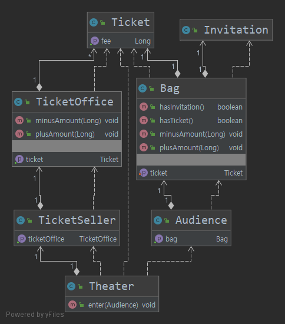
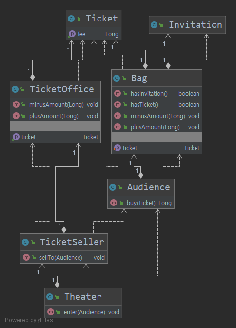
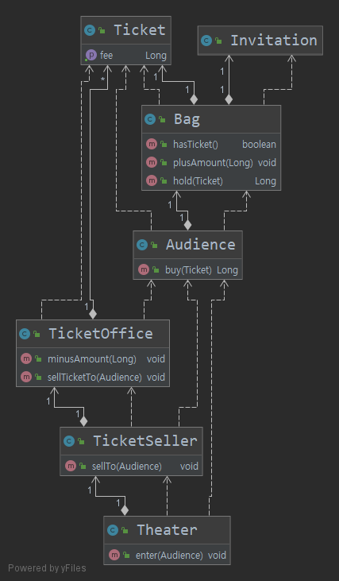

# CHAPTER01 객체, 설계

## 이론보다 실무가 먼저다

`어떤 분야를 막론하고 이론을 정립할 수 없는 초기에는 실무가 먼저 급속한 발전을 이룬다 -로버트L.글래스(소프트웨어 크리에이티비 2.0 저자) `

실무 발전 -> 실무의 실용성을 입증할 이론이 갖춰짐  -> 해당 분야가 충분히 성숙해지는 시점에 이르러서야 이론이 실무를 추월한다.

## 티켓 판매 애플리케이션 구현

- 연극이나 음악회를 공연할 수 있는 작은 소극장 경영한다 가정

- 홍보 겸 이벤트를 기회 -> 추첨을 통해 선정된 관람객에게 공연을 무료로 관람할 수 있는 초대장을 발송

  

- 이벤트 당첨된 관람객은 초대장을 티켓으로 교환한 후 입장 가능

- 이벤트 미당첨 관람객은 티켓을 구매해야 입장 가능

  - 따라서 이벤트 당첨 여부를 확인 필요

- [초대장](./Invitation.java)
- [티켓](./Ticket.java)
- [초대장,티켓,돈을 보관할 가방](./Bag.java)
- [관람객](./Audience.java)
- [매표소](./TicketOffice.java)
- [판매원](./TicketSeller.java)
- [관람객을 맞이하는 소극장](./Theater.java)

##### 클래스 다이어그램

###  소프트웨어 모듈이 가져야 하는 세가지 기능

1. 실행 중에 제대로 동작하는 것
2. 변경을 위해 존재
3. 코드를 읽는 사람과 의사소통하는 것

### 문제점

현재 티켓 판매 어플리케이션은

- 실행 중에 제대로 동작하는 것 (O)
- 변경을 위해 존재 (X)
- 코드를 읽는 사람과 의사소통하는 것 (X)

#### 예상을 빗나가는 코드

Theater클래스의 enter 메소드를 보면

- 소극장이 초대장 확인하기 위해 관람객의 가방을 마음대로 열어보거나 돈을 가져감
- 소극장이 티켓과 현금에 마음대로 접근 가능
- 티켓 꺼내고 돈을 받거나 접릭하는 일을 소극장이 수행하고 있음

**이해 가능한 코드 = 그 동작이 우리의 예상에서 크게 벗어나지 않는 코드**

현실에서는 

- 관람객이 초대장을 꺼내 판매원에게 건냄
- 티켓구매하는 관람객은 직접 가방에서 돈을 꺼내 판매원에게 건냄
- 판매원이 직접 티켓을 꺼내고 현금을 관리

**-> 현재 코드는 상식과 다르게 동작하기 때문에 코드를 읽는 사람과 제대로 의사소통 하지 못함**

또한, 현재 코드를 이해하기 위해서는 여러가지 세부적인 내용을들 모두 기억하고 있어야 함

Thearter 클래스의 enter 메서드를 보면 Audience가 Bag을 가지고 있고,

Bag안에는 현금과 티켓이 들어 있으며 TicketSeller가 TicketOffice에서 티켓을 판매하고,

TicketOffice 안에 돈과 티켓이 보관돼 있다는 모든 사실을 동시에 기억하고 있어야 한다.

**-> 이 코드는 너무 많은 세부사항을 다루고 있어 코드를 작성하는 사람뿐만 아니라 코드를 읽고 이해해야하는 사람에게 모두 부담**

#### 변경에 취약한 코드

- 관람객이 가방을 들고있지 않다면?
- 관람객이 현금이 아니라 카드로 결제한다면?
- 판매원이 매표소 밖에서 티켓 판매해야 한다면?

현재 코드에서는 순간 모든 코드가 일시에 흔들리게 된다.

관람객이 가방을 들고 있다는 가정이 바뀌었다 가정

- Audience 클래스에서 Bag을 제거
- Audience의 Bag에 직접 접근하는 Theater클래스의 enter 메서드 수정 필요

-> 객체사이의 `의존성`과 관련된 문제

`의존성`은 변경에 대한 영향을 암시한다.

`의존성`이란 말 속에 어떤 객체가 변경될 때 그 객체에게 의존하는 다른 객체도 함께 번경될 수 있다는 사실이 내포돼 있다.

**객체지향 설계는 의존성을 완전히 없애는 것이 아닌 서로 의존하면서 협력하는 객체들의 공동체를 구축하는 것이다. **

**-> 최소한의 의존성만 유지하고 불필요한 의존성을 제거**

- 객체 사이 의존성이 강한 경우  = 결합도(coupling)가 높다

### 개선하기

- Theater가 관람객의 가방과 판매원의 매표소에 직접 접근하는 것이 문제

  - 의도를 정확하게 의사소통하지 못해서 코드 이해하기 어려워짐

  - 즉, Theater가 Audience와 TicketSeller에 결합되어 있음

    -> Audience와 TicketSeller 변경시, Theater도 변경되어야해서 코드 변경 어려워짐

이를 해결하기 위해 

- Theater가 Audience와 TicketSeller에 관해 세세하기 알지 못하도록 차단
- Theater는 관람객이 소극장에 입장하는 역할만 한다.
- Audience와 TicketSeller를 자율적인 존재로 만든다.

#### 자율성을 높이자

- TicketOffice에 접근하는 코드 모두 TicketSeller클래스 내부로 옮긴다. (TicketSeller의  sellTo 메서드)
  - getTicketOffice 메서드가 제거됨 -> 오직 판매원만 매표소에 접근 가능 -> 스스로 판매하거나 티켓교환 등의 일을 함

**캡슐화(encapsultiaon) : 개념적이나 물리적으로 객체 내부의 세부적인 사항 감추는 것 **

- 캡슐화 목적 : 변경하기 쉬운 객체 만드는 것

  캡슐화 통해 내부 접근을 제한하면 객체와 객체사이 결합도를 낮출 수 있어 설계를 좀더 쉽게 변경할 수 있다.

- TicketSeller와 Audience의 결합도는 낮춘다. (Audience의 buy 메서드)

  - Audience 스스로 초대장 있는지 확인하고 현금을 지급하거나 티켓을 가방에 넣음
  - 따라서 Bag의 존재를 내부로 캡슐화함

##### 개선된 클래스 다이어그램

개선된 티켓 판매 어플리케이션은

- 실행 중에 제대로 동작하는 것 (O)
- 변경을 위해 존재 (O)
- 코드를 읽는 사람과 의사소통하는 것 (O)

#### 캡슐화와 응집도

객체 내부의 상태를 캡슐화하고 객체간에 오직 메세지를 통해서만 상호작용하도록 만든 것이 핵심이다.

밀접하게 연돤된 작업만을 수행하고 연관성 없는 작어은 다른 객체에게 위임하는 객체를 가리켜 응집도(cohesion)가 높다고 말한다.

**객체 응집도 높이기 위해서 객체 스스로 자신의 데이터를 책임져야 한다.**

#### 절차지향과 객체지향

수정하기전의 Theater 클래스의 enter메소드 안에서 관람객과 판매원으로 부터 가방과 매표소를 가져와 관람객을 입장시키는 절차를 구현했다.

-> enter 메서드는 프로세스이고, 관람객과 판매원,가방, 매표소는 데이터다.

이처럼 프로세스와 데이터를 별도의 모듈에 위치시키는 방식을 절차적 프로그래밍이라 부른다.

**변경하기 쉬운 설계는 한 번에 하나의 클래스만 변경할 수 있는 설계다 **

절차적 프로그래밍은 프로세스가 필요한 모든 데이터에 의존해야한다는 근본적인 문제점때문에 변경에 취약할 수 밖에 없다.

해결방법은 자신의 데이터는 스스로 처리하도록 이동시키는 것

**데이터와 프로세스가 동일한 모듈 내부에 위치하도록 프로그래밍하는 방식**을 **객체지향 프로그래밍**이라 한다.

- 훌륭한 객체지향 설계의 핵심은 캡슐화를 이용해 의존성을 적절히 관리함으로써 객체 사이의 결합도를 낮추는 것이다.

#### 책임의 이동

절차적 설계에서는 Theater가 전체적인 작업을 도맡아 처리함

객체지향 설계에서는 각  객체가 자신이 맡은 일을 스스로 처리함

-> Theater에 몰려있던 책임이 개별 객체로 이동

- 데이터와 프로세스가 별도의 객체에 위치 -> 절차적 프로그래밍방식일 확률이 높음
- 데이터와 프로세스가 동일한 객체 안에 위치 -> 객체지향 프로그래밍 방식일 확률이 높음

설계를 어렵게 만드는 것 : 의존성

이를 해결하는 방법은? 객체사이의 결합도는 낮추는 것

- 캡슐화를 하여 객체의 자율성을 높이고 응집도 높임

### 더 개선해보자

- Bag 클래스를 자율적인 존재로 바꾼다.
  - 내부 필드 접근하는 것을 캡슐화한다.
  - 따라서, hasInvitation,minusAmount,setTicket 메서드들은 내부에서만 사용되므로 가시성을 private으로 변경됨
- TicketOffice 클래스를 자율적인 존재로 바꾼다.
  - 캡슐화한다.
  - getTicket,plusAmount 가시성 private로 변경

##### 더 개선된 클래스다이어그램

- TicketOffice와 Audience사이에 의존성이 추가됨

이 예제를 통해서 

1. 어떤 기능을 설계하는 방법은 1가지 이상일 수 있다.
2. 동일한 기능을 한 가지 이상의 방법으로 설계할 수 있기 때문에 결국 설계는 트레이드오프의 산물이다.

### 설계가 왜 필요한가

좋은 설계란

- 오늘 요구하는 기능을 온전히 수행하면서 내일의 변경을 매끄럽게 수용할 수 있는 설계

변경가능한 코드 = 이해하기 쉬운 코드

